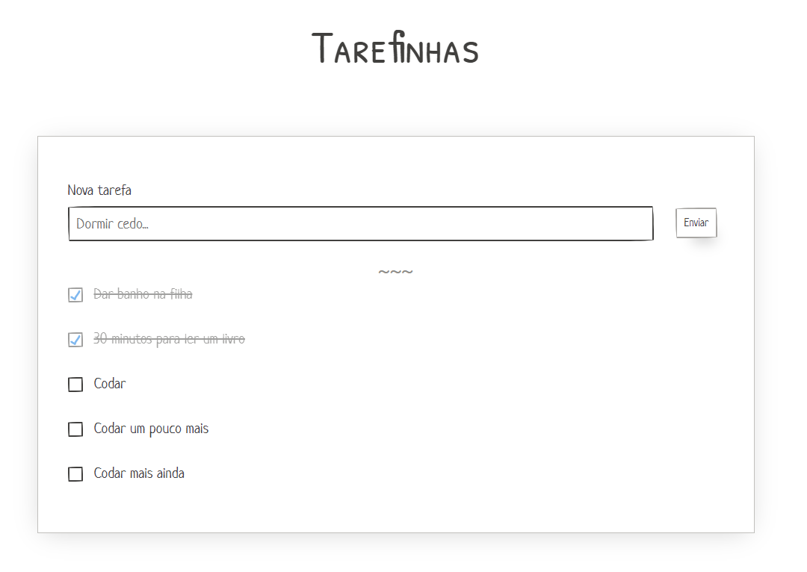

# Tarefinhas


Esse projeto tem como objetivo me ajudar em 2 objetivos... Aprender Composition API do Vue3 e utilizar PaperCSS (framework CSS bem simples e informal). **Tarefinhas** é, basicamente, uma lista de tarefas (Todo). É possível adicionar, editar, excluir e marcar com finalizado cada tarefa.

## Tecnologias utilizadas
- [Vue3](https://v3.vuejs.org/)
- [PaperCss](https://www.getpapercss.com/)
- [Typescript](https://www.typescriptlang.org/)

## Como utilizar?
Confira uma demonstração em https://todo-vue3-lime.vercel.app

Clone este repositório e utilize como quiser. Alguns comandos utilizados:

#### Instalar dependências
```
yarn install
```
#### Compilar e autoload para desenvolvimento
```
yarn serve
```
#### Compilar e minificar para produção
```
yarn build
```

## Observações pessoais
- Projetos To-do são ótimos para aprendizagem.
- Tenho que aprender mais Typescript.
- Vue3 alinhou o framework com o estilo moderno de programação.


## Próximos passos
- [ ] Re-ordenar tarefas
- [ ] Salvar lista em Localstorage
- [ ] Salvar lista em Servidor
- [ ] Filtar tarefas


